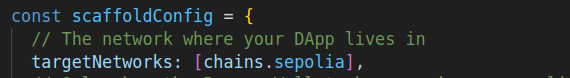

# 🔧 Starknet Maintenance Tracker


## Proceso de Mantenimiento y Certificación NFT

## 📌 Descripción del Proyecto

Este proyecto es una plataforma descentralizada que gestiona y certifica tareas de mantenimiento mediante tecnología blockchain. A través de una dApp, los usuarios pueden crear solicitudes de mantenimiento, realizar reparaciones, certificar su calidad y finalmente recibir un certificado NFT como prueba de la finalización del trabajo. La plataforma garantiza transparencia, seguridad y trazabilidad en cada paso del proceso.

##

## Process flowchart:


## Sequence diagram:


##

# 🔧 Proceso de Mantenimiento y Certificación NFT

## 📝 Paso 1: Creación de Tarea

El cliente inicia el proceso creando una tarea a través de la aplicación dApp. La dApp recibe la solicitud y genera un ID de tarea único.

## 🔨 Paso 2: Reparación de la Tarea

El reparador recibe la tarea y la completa. La dApp recibe la notificación de que la tarea ha sido completada.

## ✅ Paso 3: Certificación de la Tarea

El inspector de calidad verifica la tarea completada y la certifica. La dApp recibe la notificación de que la tarea ha sido certificada.

## 💰 Paso 4: Pago por la Tarea

El cliente paga por la tarea de mantenimiento a través de la dApp.

## 🏆 Paso 5: Creación de Certificado NFT

La dApp crea un certificado NFT que representa la tarea completada y certificada.

## 🎁 Paso 6: Entrega del Certificado NFT

La dApp entrega el certificado NFT al cliente.

##

### Dónde podemos probarla?:

Aquí tenemos el [Live Demo](https://starknet-challenge-javier-montes.vercel.app/)

<!-- ### Landing de la dApp: -->

<!--  -->

### Luego tenemos el Admin panel con todos los pasos mencionados en el flujo:


##

# Acerca del código:

## Requirimientos

- [Node (>= v18.17)](https://nodejs.org/en/download/)
- Yarn ([v1](https://classic.yarnpkg.com/en/docs/install/) or [v2+](https://yarnpkg.com/getting-started/install))
- [Git](https://git-scm.com/downloads)
- [Rust](https://rust-lang.org/tools/install)
- [asdf](https://asdf-vm.com/guide/getting-started.html)
- [Cairo 1.0 extension for VSCode](https://marketplace.visualstudio.com/items?itemName=starkware.cairo1)

### Versión de Starknet-devnet

Para asegurar el funcionamiento adecuado de scaffold-stark, su versión local de `starknet-devnet` debe ser la `0.2.3`. Para ello, primero verifique su versión local de starknet-devnet:

```sh
starknet-devnet --version
```

Si su versión local no es la `0.2.3`, ud necesitará instalarla.

- Instalar Starknet-devnet `0.2.3` vía `asdf` ([instrucciones](https://github.com/gianalarcon/asdf-starknet-devnet/blob/main/README.md)).

### Versión de Scarb

Para asegurar el funcionamiento adecuado de scaffold-stark, su versión local de `Scarb` debe ser la `2.9.2`. Para ello, primero verifique su versión local de Scarb:

```sh
scarb --version
```

Si su versión local no es la `2.9.2`, ud necesitará instalarla.

- Instalar Scarb `2.9.2` vía `asdf` ([instrucciones](https://docs.swmansion.com/scarb/download.html#install-via-asdf)).

### Versión de Starknet Foundry

Para asegurar el funcionamiento adecuado de los tests en scaffold-stark, su versión de Starknet Foundry debe ser 0.35.1. Para ello, primero verifique su versión local de Starknet Foundry:

```sh
snforge --version
```

If your Starknet Foundry version is not `0.35.1`, you need to install it.

- Instalar Starknet Foundry `0.35.1` vía `asdf` ([instrucciones](https://foundry-rs.github.io/starknet-foundry/getting-started/installation.html#installation-via-asdf)).

## Versiones compatibles

- Starknet-devnet - v0.2.3
- Scarb - v2.9.2
- Snforge - v0.35.1
- Cairo - v2.9.2
- Rpc - v0.7.1

## Requerimientos (Opción alternativa con Docker)

Como una alternativa a instalar las herramientas localmente, Ud. puede utilizar Docker. Aquí tiene lo que se necesita:

1. Instalar [Docker](https://www.docker.com/get-started/)
2. Instlar [Dev Containers](https://marketplace.visualstudio.com/items?itemName=ms-vscode-remote.remote-containers)
3. Utilizar el archivo `devcontainer.json` provisto para configurar el entorno de trabajo:
   - Esta configuración utiliza la imagen `starknetfoundation/starknet-dev:2.9.2`.
   - Ella inclure todas las herramientas necesarias ya pre-instladas, herramientas como: Scarb, Starknet Foundry, Starknet Devnet y otras dependencias.

### Empezando con la configuración Docker

Para empezar a utilizar la configuración basada en Docker:

1. Abra el proyecto en **Visual Studio Code**.
2. Abra la paleta de comandos (Ctrl+Shift+P o Command+Shift+P) y selecccione: Reabrir en contenedor...
3. Si necesita recompilar el contenedor, abra la paleta de comandos (**View -> Command Palette**) y seleccione:
   - **Dev Containers: Recompilar y reabrir en contenedor**

> Una vez en el contenedor, podrá empezar a trabajar con todas las herramientas y dependencias pre-configuradas.

## Ejecución en Devnet

Para empezar a utilizar el proyecto, siga los siguientes pasos:

1. Clone este repositorio e instale las dependencias

```bash
git clone https://github.com/javiermontescarrera/starknet-maintenance-tracker
cd starknet-maintenance-tracker
yarn install
```

2. Ejecute la cadena de bloques local en la primera terminal.

```bash
yarn chain
```

> Para levantar un fork : `yarn chain --fork-network <URL> [--fork-block <BLOCK_NUMBER>]`

Este comando inicia una red Starknet local usando Devnet. La red se estará ejecutando en su equipo local y podrá ser utilizada para pruebas y desarrollo. Ud puede personalizar la configuración de la red, para su aplicación nextjs, en `scaffold.config.ts`.

3. En una segunda terminal, despliegue el contrato:

```bash
yarn deploy
```

Este comando despliega el smart contract en la red local. El contrato está localizado en `packages/snfoundry/contracts/src`. El comando `yarn deploy` utiliza el script de despliegue ubicado en `packages/snfoundry/scripts-ts/deploy.ts` para desplegar el contrato en la red. También puede personalizar este script de despliegue.

Por defecto `Scaffold-Stark` toma la primera cuenta de `starknet-devnet` como la deployer address,

4. En una tercera terminal, inicie su aplicación NextJS:

```bash
yarn start
```

Visite su aplicación en: `http://localhost:3000`. Puede interactuar con el smart contract utilizando la página `Home` o la `Debug Contracts`. Puedes modificar la configuración de la aplicación en `packages/nextjs/scaffold.config.ts`.

5. Verifique sus variables de entorno.

## Inicio rápido con Sepolia Testnet

<details>

1. Asegúrese de haber clonado este repositorio e instalado las dependencias.

2. Prepare sus variables de entorno.

Encuentre el archivo `packages/snfoundry/.env` y agregue las variables de entorno relacionadas con Sepolia testnet utilizando la dirección y clave privada de su propia wallet account.

3. Cambie la red por defecto a Sepolia testnet.

Encuentre el archivo `packages/nextjs/scaffold.config.ts` y cambie `targetNetworks` a `[chains.sepolia]`.



4. Obtenga testnet tokens.

Ud. podrá necesitar tokens `ETH` o `STRK` de Sepoliapara desplegar su contrato en Sepolia testnet.

> Algunos faucets populares son [Starknet Faucet](https://starknet-faucet.vercel.app/) y [Blastapi Starknet Sepolia Eth](https://blastapi.io/faucets/starknet-sepolia-eth)

4. Abra una terminal, despliegue el contrato a Sepolia testnet:

```bash
yarn deploy --network sepolia
```

5. En una segunda terminal, inicie la aplicación NextJS:

```bash
yarn start
```

Visite su aplicación en: `http://localhost:3000`. Puede interactuar con el smart contract utilizando la página `Home` o la `Debug Contracts`. Puedes modificar la configuración de la aplicación en `packages/nextjs/scaffold.config.ts`.

### Versión específica de RPC

Para asegurar el correcto funcionamiento de scaffold-stark con Testnet or Mainnet, su versión de RPC debe ser `0.7.1`. Este repositorio contiene un archivo `.env.example`, donde le proveemos el RPC por defecto para la URL del RPC para la Starknet Testnet: `RPC_URL_SEPOLIA=https://starknet-sepolia.public.blastapi.io/rpc/v0_7`. Verifiquemos que la versión de RPC es `0.7.1` llamando un `POST` request una plataforma API como `Postman` o `Insommia` . Su API endpoint debería ser `https://starknet-sepolia.public.blastapi.io/rpc/v0_7` y el body debería ser:

```json
{
  "jsonrpc": "2.0",
  "method": "starknet_specVersion",
  "id": 1
}
```

Ud. debe pegar el endpoint en la plataforma API (como `Postman` o `Insommia`) y hacer click en el botón `Enviar`. Si la respuesta es `0.7.1`, entonces va por buen camino. De lo contrario, deberá corregir el RPC URL endpoint.


</details>
